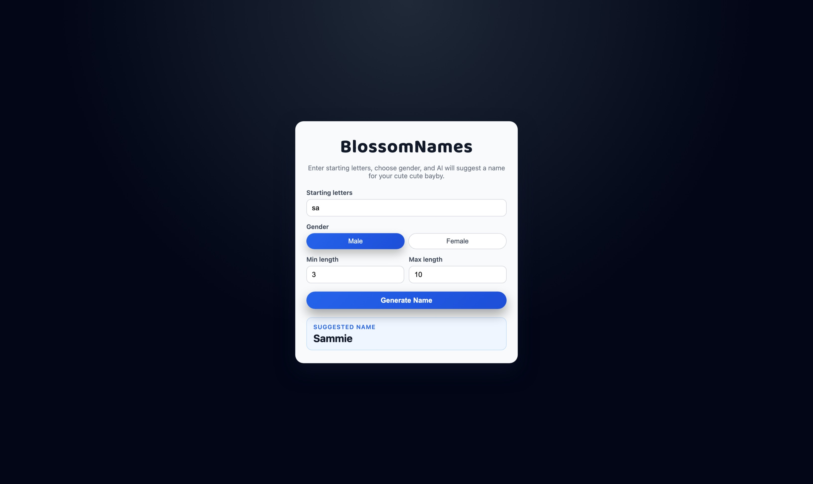

# 🌸 BlossomNames – AI Baby Name Generator




**Live Web App:** https://blossomnames.netlify.app/
**Cloud‑Hosted API:** https://baby-name-api-367079385266.asia-south1.run.app

BlossomNames is an AI‑powered baby‑name generator that predicts names **one letter at a time** using a **character‑level LSTM neural network** trained on thousands of real baby names.

✔ Supports gender‑based generation  
✔ Works with seed letters (e.g., “An” → Anna, “El” → Elijah)  
✔ Adjustable min/max length  
✔ Fully free cloud hosting  
✔ Clean & modern React UI

---

## 🧠 Model – Character‑Level LSTM

Model built using **TensorFlow + Keras**

```
model = Sequential()
model.add(Embedding(total_letters, 100))
model.add(LSTM(150))
model.add(Dropout(0.2))
model.add(Dense(total_letters, activation='softmax'))
model.compile(loss='categorical_crossentropy', optimizer=Adam(0.001), metrics=['accuracy'])
```

Training:
- Epochs: 50
- Batch size: 256
- Validation split: 10%
- Data: ~10,000 baby names (male + female)

---

## 🔤 Dataset → Tokenization

The model understands **letters**, not words.

Letter dictionary:

```
{'a':1, 'b':2, ..., 'z':26, '<end>':27}
```

Encoding example:
```
"anushka" → [1,14,21,19,8,11,1,27]
```

Names converted into thousands of n‑gram sequences teaching the model “next‑letter prediction”.

---

## 📈 Training Results (Female LSTM)

| Epoch | Accuracy | Val Accuracy |
|------:|----------|--------------|
| 1     | 0.36     | 0.55 |
| 10    | 0.61     | 0.63 |
| 50    | **0.623** | **0.636** |

---

## ✨ AI Name Generator Logic (Backend)

```
while len(name) < max_length:
    padded_sequence → model.predict()
    next_letter = index_to_char[argmax(preds)]
    name += next_letter
```

Example:
```
name_generator("sk", 5, 8) → "Skylar"
```

---

## 🏗 Backend – FastAPI + TensorFlow

API route:

```
POST /names/
form-data:
 letters="an"
 gender="female"
 max_length=8
```

Response:
```
{"name": "Anna"}
```

Local run:
```
uvicorn app.main:app --reload
```

Cloud deploy (Google Cloud Run):
```
gcloud builds submit --tag gcr.io/blossom-names/baby-name-api
gcloud run deploy
```

---

## 💻 Frontend – React (Vite)

Folder: `/frontend_web/baby-name-frontend`

Run locally:
```
npm install
npm run dev
```

Build + deploy (Netlify):
```
npm run build
netlify deploy --prod
```

---

## 📂 Project Structure

```
.
├── API/
│   ├── app/main.py
│   ├── Models/
│   │   ├── baby_name_male_lstm_v1.keras
│   │   └── baby_name_female_lstm_v1.keras
│   ├── Dockerfile
│   └── requirements.txt
|
├── frontend_web/baby-name-frontend/
│   ├── src/App.jsx
│   ├── vite.config.js
|
└── Model_Notebooks/
    ├── Name_generator_try.pdf
    └── baby_name_generator_with_sex.pdf
```

---

## 🧪 Local Dev Quick Guide

Backend:
```
cd API
uvicorn app.main:app --reload
```

Frontend:
```
cd baby-name-frontend
npm run dev
```

---

## ⭐ Planned Improvements

- Add meaning + origin lookup
- Add cultural‑based name sets (Arabic, English, Tamil, Sinhala,…)
- Export generated names to list/download

---

© Open‑source — MIT License
